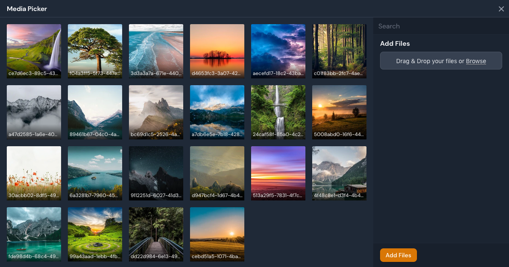
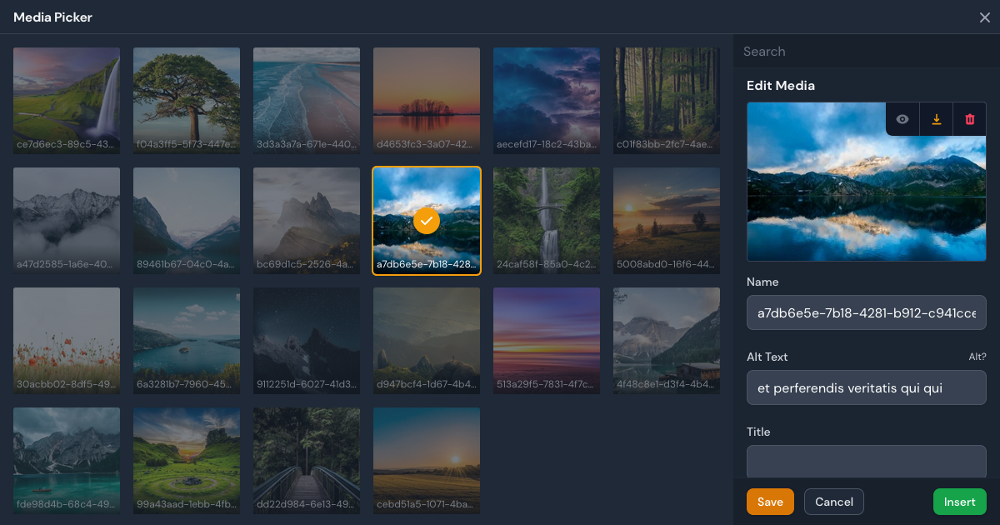
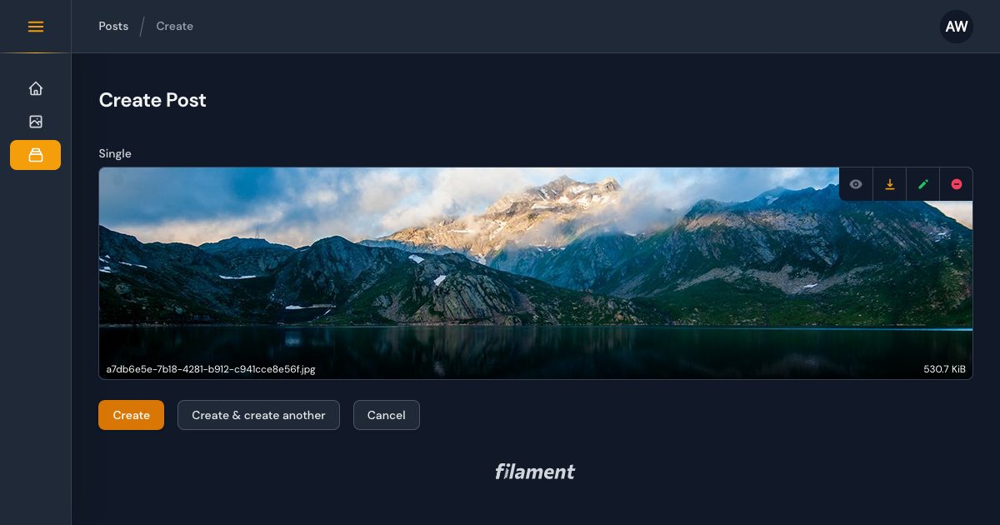

# Filament Curator

[](https://packagist.org/packages/awcodes/curator)
[](https://packagist.org/packages/awcodes/curator)

A media picker/manager plugin for Filament Admin.

> **Warning**
> This package does not work with Spatie Media Library.





## Installation

You can install the package via composer then run the installation command:

```bash
composer require awcodes/curator
php artisan curator:install
```

## Upgrade

If you are upgrading from 1.x to 2.x you will also need to run:

```bash
php artisan curator:upgrade
```

This will update Curator's database schema and create a backup of your media table that can be deleted after upgrade should you choose to do so.

***You will also need to change any references in your codebase from `$media->filename` to `$media->path`.***

## Usage

### Global Settings

Global settings for Curator are handled through the `Curator` facade.
Inside the `register()` method of a service provider you can customize the 
behaviour of Curator's resources. All methods are optional.

```php
use Awcodes\Curator\Facades\Curator;

public function register()
{
    Curator::resourceLabel(string)
        ->navigationIcon(string)
        ->tableHasIconActions(bool|Closure|null)
        ->tableHasGridLayout(bool|Closure|null)
        ->preserveFilenames(bool|Closure)
        ->acceptedFileTypes(array|Closure)
        ->maxWidth(int|Closure)
        ->minSize(int|Closure)
        ->maxSize(int|Closure)
        ->disk(string|Closure)
        ->directory(string|Closure)
        ->pathGenerator(string|null)
        ->visibility(string|Closure)
        ->cloudDisks(array)
        ->imageCropAspectRatio(string|Closure|null)
        ->imageResizeTargetHeight(string|Closure|null)
        ->imageResizeTargetWidth(string|Closure|null);
}
```

### Curator Picker Field

Include the CuratorPicker field in your forms to trigger the modal and either
select an existing image or upload a new one. Some common methods
from Filament's `FileUpload` component can be used to help with sizing,
validation, etc. for specific instances of each CuratorPicker.

```php
use Awcodes\Curator\Components\Forms\CuratorPicker;

CuratorPicker::make(string $fieldName)
    ->label(string $customLabel)
    ->buttonLabel(string | Htmlable | Closure $buttonLabel)
    ->color('primary|secondary|success|danger') // defaults to primary
    ->outlined(true|false) // defaults to true
    ->size('sm|md|lg') // defaults to md
    ->fitContent(true|false) // defaults to false (forces image to fit inside the preview area)
    ->pathGenerator(DatePathGenerator::class|UserPathGenerator::class) // see path generators below
    // see https://filamentphp.com/docs/2.x/forms/fields#file-upload for more information about the following methods
    ->preserveFilenames()
    ->maxWidth()
    ->minSize()
    ->maxSize()
    ->rules()
    ->acceptedFileTypes()
    ->disk()
    ->visibility()
    ->directory()
    ->imageCropAspectRatio()
    ->imageResizeTargetWidth()
    ->imageResizeTargetHeight()
```

Media can also be related to models by simply adding the relationship to your
model.

```php
use Awcodes\Curator\Models\Media;

public function featuredImage(): HasOne
{
    return $this->hasOne(Media::class, 'id', 'featured_image');
}
```

### Path Generation

By default, Curator will use the directory and disk set in the config to
store your media. If you'd like to store the media in a different way
Curator comes with Path Generators that can be used to modify the behavior.
Just set the one you want to use the `register()` method of a service provider.

```php
public function register()
{
    Curator::pathGenerator(DatePathGenerator::class);
}
```

#### Available Generators

`DefaultPathGenerator` will save files in disk/directory.

`DatePathGenerator` will save files in disk/directory/Y/m/d.

`UserPathGenerator` will save files in disk/directory/user-auth-identifier

You are also free to use your own Path Generators by implementing the
`PathGenerator` interface on your own classes.

```php
use Awcodes\Curator\Generators;

class CustomPathGenerator implements PathGenerator
{
    public function getPath(?string $baseDir = null): string
    {
        return ($baseDir ? $baseDir . '/' : '') . 'my/custom/path';
    }
}
```

Path Generators can also be passed into the `directory()` method on the
`CuratorPicker` field for per instance use.

```php
CuratorPicker::make(string $fieldName)
    ->label(string $customLabel)
    ->pathGenerator(CustomPathGenerator::class),
```

### Curator Column

To render your media in a table Curator comes with an `CuratorColumn` which has the same methods as Filament's ImageColumn.

```php
CuratorColumn::make('featured_image')
    ->size(40)
```

### Glider Blade Component

To make it as easy as possible to output your media, Curator comes with an 
`<x-curator-glider>` blade component.

See [Glide's quick reference](https://glide.thephpleague.com/2.0/api/quick-reference/) for more information about Glide's options

**Special attributes**

- media: id (int) or (Media) model instance (***required***)
- loading: defaults to 'lazy'
- glide: this can be used to pass in a glide query string if you do not want to use individual attributes

```html
<div class="aspect-video w-64">
    <x-curator-glider
        class="object-cover w-auto"
        :media="1" 
        loading=""
        glide=""
        background=""
        blur=""
        border=""
        brightness=""
        contrast=""
        crop=""
        device-pixel-ratio=""
        filter=""
        fit=""
        flip=""
        format=""
        gamma=""
        height=""
        quality=""
        orientation=""
        pixelate=""
        sharpen=""
        width=""
        watermark-path=""
        watermark-width=""
        watermark-height=""
        watermark-x-offset=""
        watermark-y-offset=""
        watermark-padding=""
        watermark-position=""
        watermark-alpha=""
    />
</div>
```

### Custom Model and Resources

Should you need to override the default Model and Resources, it is recommended 
that you swap your own model and resources in the service container.

```php
use Awcodes\Curator\Models\Media;

class YourNotAsCoolMediaModel extends Media
{
    // ... custom methods and properties
}

// and in a service provider
public function register()
{
    $this->app->bind(Media::class, fn() => new YourNotAsCoolMediaModel());
}
```

## Theming

If you are using a custom theme for Filament you will need to add this plugin's
views to your Tailwind CSS config.

```js
content: [
    ...
    "./vendor/awcodes/curator/resources/views/**/*.blade.php",
]
```

## Testing

```bash
composer test
```

## Changelog

Please see [CHANGELOG](CHANGELOG.md) for more information on what has changed recently.

## Contributing

Please see [CONTRIBUTING](.github/CONTRIBUTING.md) for details.

## Security Vulnerabilities

Please review [our security policy](../../security/policy) on how to report security vulnerabilities.

## Credits

- [Adam Weston](https://github.com/awcodes)
- [The PHP League](https://glide.thephpleague.com/) for the awesome Glide package.
- [All Contributors](../../contributors)

## License

The MIT License (MIT). Please see [License File](LICENSE.md) for more information.
